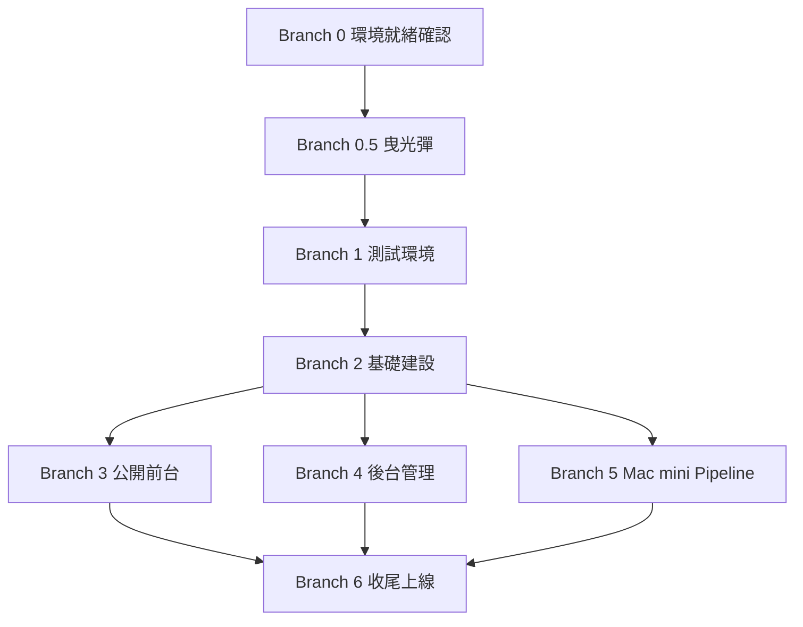
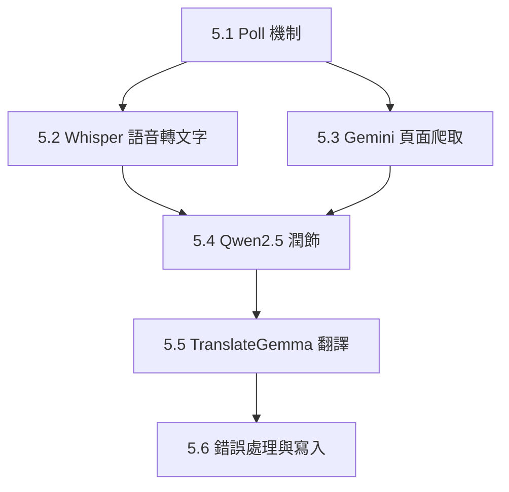

# Personal Blog — Voice & Conversation to Article Pipeline

**願景：** 一個支援語音輸入與 Gemini 對話擷取的個人部落格。
透過兩條輸入管道生成草稿，人工校稿後發佈中英雙語版本。
AI 處理完全在本地 Mac mini 執行（Qwen2.5），前台部署於 Vercel。

---

## 四大分類
- `work` 工作 / `technology` 科技 / `life` 生活 / `sadhaka` 修行

分類由 AI 自動判斷。文字雲從文章內容萃取關鍵字作為彈性標籤。

---

## 核心工作流程

### 輸入來源 A：語音錄音
錄音上傳 → Whisper large-v3 轉逐字稿（Mac mini）
→ Qwen2.5（Ollama）潤飾中文 + 自動分類 + 萃取關鍵字
→ TranslateGemma 翻譯成英文（Mac mini）→ 存為草稿

### 輸入來源 B：Gemini 對話
貼上 Gemini share URL → Mac mini 爬取對話內容
→ Qwen2.5（Ollama）整理成中文文章 + 分類 + 關鍵字
→ TranslateGemma 翻譯成英文 → 存為草稿

### 共用後段
草稿 → 人工校稿（可分別編輯中英版本）→ 發佈

---

## 任務依賴圖（DAG）

### Branch 層級依賴



### Branch 5 內部依賴（最複雜）



> Branch 3、4、5 互相獨立，可平行開發。
> Branch 5 中，5.2 與 5.3 可平行開發，5.4 須等兩者完成。

---

## Tech Stack
- **前台:** Next.js (App Router)，Vercel
- **後台:** Next.js Admin Route，NextAuth + Google OAuth
- **i18n:** Next.js 內建（/zh/ 與 /en/），依瀏覽器語言自動切換
- **留言:** Giscus（GitHub Discussions）
- **Database:** Neon Postgres
- **Storage:** Vercel Blob（音檔）
- **STT:** mlx-whisper（Mac mini，本地，需 ffmpeg）
- **AI 潤飾 / 分類 / 關鍵字:** Qwen2.5 14B（Mac mini，本地，Ollama）
- **翻譯:** Qwen2.5 14B（Mac mini，本地，與潤飾共用同一模型）
- **本地背景服務:** Mac mini Python script

---

## 視覺規範
- **風格:** 極簡、個人、沉靜、有深度
- **字型:** Noto Serif TC
- **配色:** 米白底 #F8F5F0 + 深灰文字 #2D2D2D
- **版面:** 單欄，最大寬度 680px，大量留白
- **動效:** 僅文章切換淡入
- **UI:** Tailwind CSS + shadcn/ui

---

## AI 協作守則

這份文件是 AI 的外部記憶與行為約束。每次對話開始時提供此文件，
並要求 AI 遵守以下規則：

1. **最小修改原則：** 每次只做達成當前任務的最小修改，
   不得動到與任務無關的檔案或模組
2. **質疑新增：** 引入新 library 或建立新檔案前，
   必須先說明為何現有結構無法解決
3. **先求跑通，再求完美：** 優先讓功能可運作，
   重構是獨立的下一步，不在同一個任務內混做
4. **拒絕發散：** 嚴格拒絕牽扯不相關模組的擴散性更動，
   一次 commit 只解決一件事
5. **測試不過度：** 不為簡單邏輯建立龐大的 mock 基礎設施，
   測試應與功能程式碼大小相稱
6. **完成的定義（DoD）：** 一個節點只有在所有 success criteria（含 [GREEN]、無標籤項目）
   都完成後才算 done。若節點有 [REFACTOR]，必須也完成才可標記整個節點為 done。
   不得跳過任何項目直接進入下一個節點。

---

## 環境建置說明

### 工具分層觀念
```
系統工具層（長期保留，跨專案共用）
  nvm、pyenv、brew、ollama → 裝一次，brew uninstall 可清除

專案隔離層（刪專案資料夾即完全清除）
  venv、node_modules、.nvmrc → 真正做到不影響其他專案
```

### 缺少工具時，AI 的處理方式
1. 先用 which / --version 偵測確認
2. 提供 Homebrew 安裝指令
3. 只在 venv / nvm 環境內操作，不動系統層
4. 確認安裝成功後繼續

### 開發機需求清單
- [ ] fnm：`brew install fnm`，建立 .nvmrc 鎖定版本
- [ ] pyenv：`brew install pyenv`
- [ ] Python venv：`python -m venv .venv`（在專案資料夾內）
- [ ] Vercel 帳號：vercel.com，執行 `npx vercel login`
- [ ] Neon 帳號：neon.tech，取得 connection string
- [ ] Qwen2.5 14B：`ollama pull qwen2.5:14b`
- [ ] Google OAuth Client ID（後台登入）
- [ ] GitHub repo + Giscus 設定

### Mac mini 需求清單
- [ ] Ollama：`brew install ollama`
- [ ] mlx-whisper：`pip install mlx-whisper`（需 ffmpeg，已全域安裝）
- [ ] Python venv + requirements.txt
- [ ] 設定開機自動啟動 poll script

---

## Branch 0：環境就緒確認

> 正式開發前的前置節點。確認開發機與 Mac mini 的所有依賴都就緒，
> 才能進入曳光彈。

**Input:** 開發機與 Mac mini 均已開機、帳號與 API Key 申請完畢
**Output:** 所有工具與服務確認可用
**Success criteria:**
- [ ] fnm 已安裝，`fnm --version` 回傳版本號
- [ ] pyenv 已安裝，`pyenv --version` 回傳版本號
- [ ] `npx vercel login` 完成，Vercel 帳號已連結
- [ ] Neon connection string 已取得，可成功連線 DB
- [ ] Qwen2.5 14B 已拉取，`ollama list` 輸出包含 `qwen2.5:14b`
- [ ] Google OAuth Client ID 已設定於 .env.local
- [ ] GitHub repo 已建立
- [ ] Mac mini：`curl http://localhost:11434/api/tags` 回傳 200
- [ ] mlx-whisper 已安裝，`python -c "import mlx_whisper"` 不報錯
- [ ] Mac mini：`ollama list` 輸出包含 `translategemma`

> 若 Mac mini 無法連上 localhost:11434，依序排查：
> 1. `ollama serve` 是否已執行
> 2. 防火牆是否封鎖 11434 port
> 3. Python script 與 Ollama 是否在同一台機器上執行

---

## Branch 0.5：曳光彈（Tracer Bullet）

> 在建立任何測試基礎設施或完整模組之前，先用最簡單的方式
> 走通一條從頭到尾的垂直切片。允許有手動步驟、不求美觀、
> 不求模組化，只求驗證這條路可以走通。
> 路通了，才展開 Branch 1–5。

**目標路徑：**
上傳一段音檔 → Whisper 轉文字 → Qwen2.5 潤飾
→ 後台出現草稿 → 手動發佈 → 前台可見文章

**Input:** Branch 0 所有項目完成
**Output:** 最小可運作的完整流程
**Success criteria:**
- [ ] 可上傳一段測試音檔
- [ ] Mac mini 處理後，後台出現包含標題與內文的草稿
- [ ] 手動點擊發佈後，前台 /zh/posts/[slug] 可正確顯示文章

---

## Branch 1：測試環境建置

### 1.1 Jest + React Testing Library

**Input:** 已初始化的 Next.js 專案
**Output:** jest.config.js、測試可執行
**Success criteria:**
- [ ] `npm test` 執行不報錯
- [ ] 可成功渲染一個簡單元件並通過測試

### 1.2 Playwright E2E

**Input:** 已初始化的 Next.js 專案、本地可啟動的 dev server
**Output:** playwright.config.ts、tests/ 資料夾
**Success criteria:**
- [ ] `npx playwright test` 執行不報錯
- [ ] 可成功開啟首頁並通過基本存取測試

### 1.3 pytest（Mac mini）

**Input:** Mac mini Python venv 已建立
**Output:** pytest 安裝完成、tests/ 資料夾
**Success criteria:**
- [ ] `pytest` 執行不報錯
- [ ] 可成功執行一個簡單的 assert 測試

### 1.4 CI（GitHub Actions）

**Input:** GitHub repo、Branch 1.1–1.3 完成
**Output:** .github/workflows/test.yml
**Success criteria:**
- [ ] 每次 push 自動觸發測試
- [ ] 測試失敗時 CI 標記 red，不允許合併

---

## Branch 2：專案基礎建設

### 2.1 Next.js 初始化

**Input:** Node.js 環境、.nvmrc 設定完成
**Output:** Next.js App Router 專案、Tailwind + shadcn/ui、i18n 設定（zh/en）
**Success criteria:**
- [ ] `npm run dev` 可成功啟動，首頁可瀏覽
- [ ] Tailwind class 可正確套用樣式
- [ ] /zh 與 /en 路由不報錯

### 2.2 Neon Postgres 連線

**Input:** Neon connection string、.env.local
**Output:** DB 連線模組（/lib/db.ts）
**Success criteria:**
- [ ] [RED] 未設定 connection string 時應拋出明確錯誤
- [ ] [GREEN] 設定正確後可成功查詢 DB
- [ ] [REFACTOR] 確認連線模組無重複初始化，singleton 模式

### 2.3 posts 資料表 Migration

**Input:** DB 連線正常、欄位設計確認
**Output:** posts 資料表
      （id, title_zh, title_en, slug, content_zh, content_en,
        status, category, tags, created_at, updated_at）
**Success criteria:**
- [ ] [RED] 欄位不存在時查詢應失敗
- [ ] [GREEN] Migration 執行後所有欄位存在且型別正確
- [ ] Migration 可重複執行不報錯（冪等性）

### 2.4 jobs 資料表 Migration

**Input:** DB 連線正常
**Output:** jobs 資料表
      （id, type, source_url, transcript, post_id, status, created_at）
**Success criteria:**
- [ ] [RED] 欄位不存在時查詢應失敗
- [ ] [GREEN] Migration 執行後所有欄位存在
- [ ] type 欄位限制只接受 voice / gemini

### 2.5 NextAuth + Google OAuth

**Input:** Google OAuth Client ID & Secret、.env.local
**Output:** NextAuth 設定、/admin 路由保護
**Success criteria:**
- [ ] [RED] 未登入存取 /admin 應回傳 401
- [ ] [GREEN] 未登入導向登入頁
- [ ] [RED] 登入後存取 /admin 應正常進入
- [ ] [GREEN] Google 登入成功後可進入後台
- [ ] [REFACTOR] 確認 middleware 只保護 /admin，不影響公開路由

---

## Branch 3：公開 Blog 前台

### 3.1 文章列表首頁

**Input:** posts 資料表有測試資料、DB 連線正常
**Output:** 首頁元件，列出已發佈文章（標題、摘要、分類、日期）
**Success criteria:**
- [ ] [RED] 首頁應渲染已發佈文章，草稿不應出現
- [ ] [GREEN] 元件正確過濾 status=published
- [ ] [REFACTOR] 確認資料查詢邏輯不在元件內，抽成獨立函式

### 3.2 分類篩選頁

**Input:** 首頁完成、四大分類資料存在
**Output:** /category/[slug] 路由，篩選該分類文章
**Success criteria:**
- [ ] [RED] /category/work 只應顯示 work 分類文章
- [ ] [GREEN] 路由正確篩選
- [ ] 不存在的分類應回傳 404

### 3.3 i18n 語言自動切換

**Input:** Next.js i18n 設定完成、文章有中英雙版本資料
**Output:** Accept-Language 自動路由、語言切換按鈕
**Success criteria:**
- [ ] [RED] 瀏覽器語言 zh 時應顯示中文 title
- [ ] [GREEN] Accept-Language 路由實作完成
- [ ] [RED] 點擊語言切換後頁面顯示對應語言
- [ ] [GREEN] 切換 UI 實作完成
- [ ] [REFACTOR] 語言切換邏輯確認只存在一處，無重複

### 3.4 全文搜尋

**Input:** posts 資料表、Postgres full-text search index
**Output:** /api/search API route、搜尋框元件
**Success criteria:**
- [ ] [RED] 搜尋「冥想」應回傳包含該字的文章
- [ ] [GREEN] Postgres tsvector index 建立，API 回傳正確結果
- [ ] 中英文搜尋分別使用對應語言的 tsvector
- [ ] [REFACTOR] 確認搜尋邏輯在 API route，元件只負責 UI

### 3.5 文字雲與標籤篩選

**Input:** posts 資料表的 tags 欄位有資料
**Output:** 文字雲元件、/tag/[slug] 篩選路由
**Success criteria:**
- [ ] [RED] 文字雲應渲染所有文章的標籤
- [ ] [GREEN] 元件正確從 DB 聚合標籤
- [ ] [RED] 點擊標籤應只顯示含該標籤的文章
- [ ] [GREEN] 標籤篩選路由實作完成

### 3.6 文章詳細頁

**Input:** posts 資料表有資料、slug 唯一
**Output:** /[lang]/posts/[slug] 路由、Markdown 渲染、SEO meta、Giscus、RSS
**Success criteria:**
- [ ] [RED] /zh/posts/[slug] 應渲染正確中文內容
- [ ] [GREEN] 動態路由實作，Markdown 正確渲染
- [ ] [RED] SEO meta 應包含對應語言的 title 與 description
- [ ] [GREEN] generateMetadata 實作完成
- [ ] [RED] E2E：Giscus 區塊應正確載入
- [ ] [GREEN] Giscus 整合完成
- [ ] [RED] /feed/zh.xml 應回傳合法 RSS XML
- [ ] [GREEN] 中英 RSS feed 實作完成
- [ ] [REFACTOR] 確認頁面元件輕薄，資料抓取邏輯分離

---

## Branch 4：後台管理介面

### 4.1 文章列表

**Input:** /admin 路由保護完成、posts 資料表有資料
**Output:** /admin/posts 頁面，列出草稿與已發佈文章
**Success criteria:**
- [ ] [RED] 列表應同時顯示草稿與已發佈文章並標示狀態
- [ ] [GREEN] 列表頁實作完成
- [ ] 可依狀態、分類篩選

### 4.2 Markdown 編輯器

**Input:** 文章資料存在（草稿）
**Output:** 中英分頁的 Markdown 編輯器、儲存 API
**Success criteria:**
- [ ] [RED] 儲存後 DB 中對應欄位應更新
- [ ] [GREEN] 編輯器 + /api/admin/posts/[id] PATCH 實作完成
- [ ] 中英版本可分頁切換獨立編輯
- [ ] 支援 Markdown 即時預覽
- [ ] [REFACTOR] 確認編輯器狀態管理簡單，無不必要的 re-render

### 4.3 發佈控制

**Input:** 編輯器完成、posts 有 status 欄位
**Output:** 發佈 / 取消發佈 / 刪除功能
**Success criteria:**
- [ ] [RED] 發佈後 status 應變為 published
- [ ] [GREEN] 發佈 API 實作完成
- [ ] [RED] 刪除後文章不應出現在任何列表
- [ ] [GREEN] 刪除功能實作完成

### 4.4 新增日誌（語音 / Gemini URL）

**Input:** Vercel Blob 設定完成、jobs 資料表存在
**Output:** 語音上傳與 Gemini URL 輸入頁面、jobs 新增對應 pending 記錄
**Success criteria:**
- [ ] [RED] 上傳音檔後 jobs 應新增 type=voice、status=pending 記錄
- [ ] [GREEN] 語音上傳頁面 + API 實作完成
- [ ] [RED] 貼上 Gemini URL 後 jobs 應新增 type=gemini、status=pending 記錄
- [ ] [GREEN] Gemini URL 輸入頁面 + API 實作完成
- [ ] 無效輸入應顯示錯誤訊息
- [ ] 支援瀏覽器錄音（MediaRecorder API）與上傳現有音檔
- [ ] [REFACTOR] 確認兩種輸入共用同一個 job 建立邏輯，不重複

### 4.5 任務狀態顯示

**Input:** jobs 資料表有資料
**Output:** 任務列表，顯示 pending / processing / done / error 狀態
**Success criteria:**
- [ ] [RED] 任務列表應正確反映各狀態
- [ ] [GREEN] 狀態顯示元件實作完成
- [ ] error 狀態應顯示錯誤訊息與重試按鈕

---

## Branch 5：本地背景服務（Mac mini Python Script）

### 5.1 Poll 機制

**Input:** DB connection string、jobs 資料表存在
**Output:** poll.py，每分鐘掃描 status=pending 的任務
**Success criteria:**
- [ ] [RED] 模擬 DB 有 pending job，poll 應正確取得並將 status 改為 processing
- [ ] [GREEN] poll 機制實作完成
- [ ] 同一時間不會重複處理同一個 job（加鎖）
- [ ] [REFACTOR] 確認 poll 邏輯與處理邏輯分離，各自單一職責

### 5.2 Whisper 語音轉文字

**Input:** 音檔 URL（來自 Vercel Blob）、mlx-whisper 已安裝於 .venv
**Output:** 逐字稿字串，存入 jobs.transcript
**Success criteria:**
- [ ] [RED] 給定測試音檔，函式應回傳非空字串
- [ ] [GREEN] Whisper 呼叫函式實作完成
- [ ] 轉錄結果存回 jobs 資料表

### 5.3 Gemini 頁面爬取

**Input:** Gemini share URL（格式：gemini.google.com/share/...）
**Output:** 結構化對話內容字串
**Success criteria:**
- [ ] [RED] 給定模擬 HTML，解析函式應正確萃取對話內容
- [ ] [GREEN] 爬取與解析函式實作完成
- [ ] 頁面不可存取時應拋出明確錯誤
- [ ] [REFACTOR] 確認爬取與解析是兩個獨立函式，不混在一起

### 5.4 Qwen2.5 潤飾 + 分類 + 關鍵字

**Input:** 逐字稿或對話內容字串、Ollama 已安裝 Qwen2.5 14B
**Output:** 結構化物件（title_zh, content_zh, category, tags）
**Success criteria:**
- [ ] [RED] 給定中文逐字稿，應回傳含 title_zh, content_zh 的結構
- [ ] [GREEN] Qwen2.5 Ollama 呼叫實作完成
- [ ] [RED] category 應為 work / technology / life / sadhaka 其中之一
- [ ] [GREEN] 分類驗證邏輯實作完成
- [ ] [RED] tags 應為非空陣列
- [ ] [GREEN] 關鍵字萃取實作完成
- [ ] [REFACTOR] 確認 prompt 集中管理，不散落在程式碼各處

### 5.5 TranslateGemma 翻譯

**Input:** title_zh, content_zh、Ollama 已安裝 Qwen2.5 14B
**Output:** title_en, content_en 字串，寫入 posts 草稿
**Success criteria:**
- [ ] [RED] 給定中文文章，應回傳非空英文字串
- [ ] [GREEN] Qwen2.5 翻譯呼叫函式實作完成
- [ ] [RED] 翻譯後 posts 草稿應包含 title_en 與 content_en
- [ ] [GREEN] 翻譯結果寫入 DB 實作完成

### 5.6 錯誤處理與寫入

**Input:** 5.1–5.5 各步驟完成
**Output:** 完整 pipeline，成功時寫入 posts 草稿，失敗時記錄 error
**Success criteria:**
- [ ] [RED] 任一步驟失敗，job status 應為 error 並保留 error message
- [ ] [GREEN] 錯誤處理實作完成
- [ ] 後台可對 error job 手動觸發重試
- [ ] 成功時 job status 改為 done，posts 草稿可在後台看到
- [ ] [REFACTOR] 確認錯誤處理邏輯集中，各步驟函式不各自處理錯誤

---

## Branch 6：收尾與上線

### 6.1 RWD 響應式

**Input:** 所有前台與後台頁面完成
**Output:** 手機與桌機版面均正確顯示
**Success criteria:**
- [ ] [RED] E2E：手機版（375px）首頁、文章頁、後台不破版
- [ ] [GREEN] RWD 修正完成

### 6.2 完整流程 E2E

**Input:** 所有 Branch 完成
**Output:** 完整使用者流程通過
**Success criteria:**
- [ ] [RED] E2E：上傳音檔 → 草稿出現 → 人工發佈 → 前台可見
- [ ] [GREEN] 語音流程無斷點
- [ ] [RED] E2E：貼上 Gemini URL → 草稿出現 → 發佈 → 前台可見
- [ ] [GREEN] Gemini 流程無斷點

### 6.3 上線

**Input:** 所有測試通過、Vercel 部署正常
**Output:** 線上可存取的 blog
**Success criteria:**
- [ ] 自訂網域設定完成（optional）
- [ ] HTTPS 正常
- [ ] 所有環境變數在 Vercel 設定完畢
- [ ] 手動測試一篇語音日誌完整走完流程

---

## Memento Method（外部狀態紀錄）

每次會話結束前，要求 AI 更新以下區塊，記錄當前狀態。
下次對話開始時，將此文件提供給 AI，它即可從正確的位置繼續。

### 使用方式
會話結束前對 AI 說：
> 「請更新 AGENTS.md 的當前狀態區塊，記錄這次完成了什麼、遇到什麼問題、下一步從哪裡繼續。」

---

## 當前狀態

**最後更新：** 2026-03-27
**目前進度：** Branch 0 完成，準備進入 Branch 0.5

### 已完成
- Branch 0：環境就緒確認（全部通過）
  - fnm、pyenv、Vercel 帳號、Neon connection string、Google OAuth Client ID 均已設定
  - GitHub repo 已建立（thehyyu/my-first-ai-project）
  - Qwen2.5 14B 已安裝於 Ollama
  - mlx-whisper 已安裝於專案 .venv
  - 翻譯改用 Qwen2.5 14B，translategemma 不需另外安裝

### 進行中
（無）

### 遇到的挑戰
- Mac mini 與開發機為同一台，無需分開考慮環境
- requirements.txt 已存在且包含所有 Mac mini 所需套件，直接 pip install -r 即可

### 下一步
進入 Branch 0.5 曳光彈：走通「上傳音檔 → Whisper 轉文字 → Qwen2.5 潤飾 → 後台出現草稿 → 手動發佈 → 前台可見」的最小路徑。
